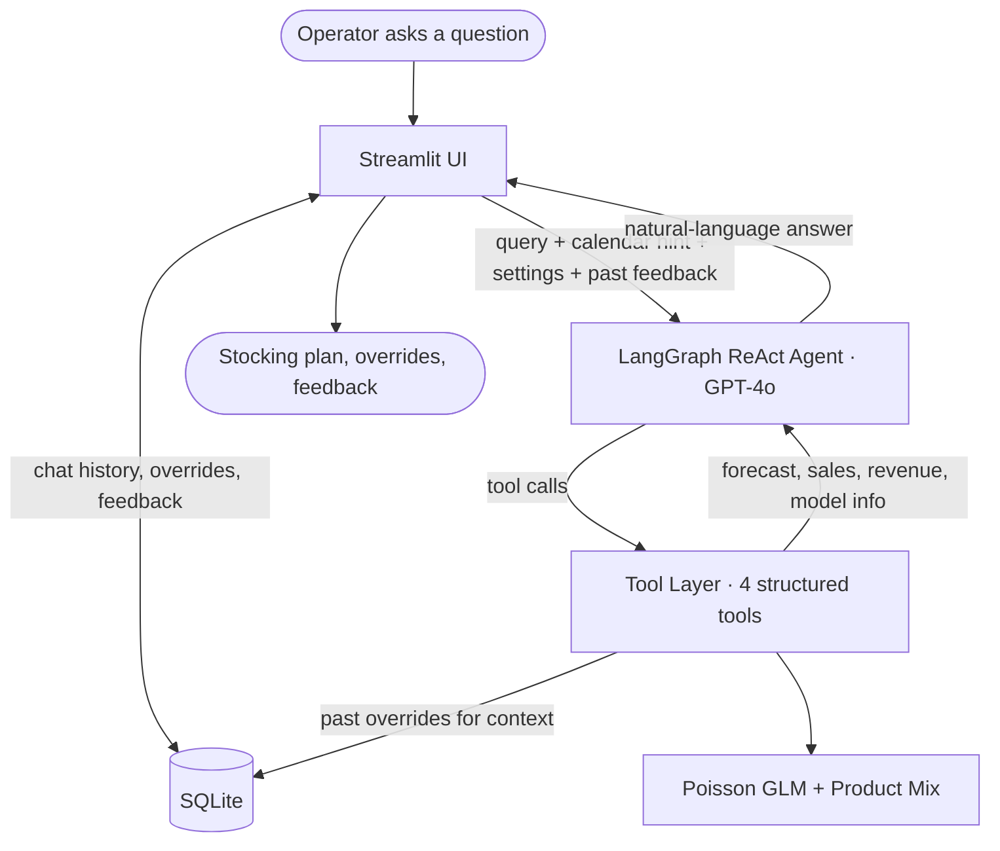

# Coffee Ops Copilot

A natural-language AI assistant that helps vending machine operators answer **"What should I stock, and when?"** with honest uncertainty, per-product recommendations, and override controls.

## Quick Start

```bash
pip install -r requirements.txt
cp .env.example .env          # add your OPENAI_API_KEY
streamlit run app.py
```

Optional: set `LANGSMITH_TRACING=true` and add a `LANGSMITH_API_KEY` in `.env` for full tool-call observability.

## Architecture



The system has four layers. Each one is a deliberate choice.

### Agent Layer (`agent/`)

The agent uses LangGraph's `create_react_agent` (ReAct pattern) with GPT-4o at temperature 0.

**Why ReAct over a fixed pipeline.** The manager's questions range from "plan tomorrow" to "compare the two machines" to "how accurate is the model." A fixed pipeline would need separate routes for each. ReAct lets the LLM reason about which tools to call and how to compose the results into a natural answer.

**Why GPT-4o.** It handles structured tool calls reliably, follows the system prompt's framing rules (lead with action, not math), and stays within the "you support, the manager decides" guardrail.

**System prompt design** (`agent/prompts.py`). The prompt establishes a few principles that shape every response. The agent leads with recommendations, not model internals ("I'd suggest stocking X" not "the model predicts lambda=2.8"). It flags uncertainty honestly, especially for Machine 2's sparse data. It references past overrides when they exist ("you bumped Lattes up last time for this window"). And it distinguishes between `day` scope (full-day minimum inventory floors) and `window` scope (top-up guide for a specific time range).

**Context injection.** Before each agent call, the UI appends metadata to the user's message: today's date (so the agent resolves "tomorrow" to a real ISO date), the selected safety level, default machine preference, and any recent negative feedback comments. This keeps the agent grounded without requiring it to call extra tools for context.

### Tool Layer (`agent/tools.py`)

Four tools, each with a clear purpose:

- **`forecast_demand`** is the core tool. It takes a date, scope (day or window), time range, and safety level. It always returns both machines so the UI can render overrides for each. Internally it calls the model, converts the continuous rate to a discrete planning bound, splits by product mix, assigns demand tiers, and attaches any past overrides from the database.
- **`get_sales_summary`** handles historical questions ("best sellers last month," "busiest times"). Groups by product, daypart, day of week, or machine.
- **`get_revenue_insights`** surfaces business opportunities by analyzing revenue patterns across dayparts and product mix.
- **`get_model_insights`** explains the model itself, returning coefficients (demand trend, machine comparison, time-of-day effects) and accuracy metrics (MAE, prediction-interval coverage). Used when the manager asks "why" or "how accurate."

### Model Layer (`models/`)

**Why Poisson GLM.** The data is count-based (drinks sold per 3-hour window) and sparse. 96.5% of per-product time slots have zero sales, so modeling individual products is not viable. A Poisson GLM on total volume is a natural fit for count data, handles low volumes gracefully, and gives calibrated prediction intervals out of the box.

**Two-stage approach.** Stage 1 predicts total drink volume per window per machine. Stage 2 splits that total across products using historical mix proportions. This works because the mix is stable over time (<9% drift validated in EDA) and avoids the noise of trying to predict 0-or-1 counts per product.

**Rate to integer.** The GLM predicts a continuous rate (e.g. 1.52 drinks on average). The Poisson distribution's percentile function (`ppf`) converts that to a discrete planning bound at the manager's chosen safety level (e.g. 3 drinks at the 90th percentile). That integer is what gets split across products. The manager never sees the raw rate unless they open the transparency expander.

**Machine 2 fallback.** Machine 2 has ~250 transactions vs. Machine 1's ~3,600. Its product mix is unstable, so the system uses Machine 1's mix proportions for both machines and flags it transparently. Machine 2's capacity is also clamped to the 8 products in Machine 1's set rather than its raw 30 SKUs, since there isn't enough data to make reliable per-product recommendations for the full catalog.

**Demand tiers.** Products are bucketed into high, moderate, and keep-stocked tiers based on their expected demand share. This gives the manager a quick read on what to check first without requiring them to parse individual numbers.

### UI Layer (`app.py`, `ui/`)

The UI is a Streamlit chat interface with four layers of interaction per response.

**Chat.** The agent's natural-language answer appears first. Suggested queries populate the empty state so the manager doesn't have to know the right phrasing.

**Transparency ("Why this recommendation").** A collapsible expander shows the math in plain language. Model prediction (average rate), planning upper bound (percentile), per-product breakdown with mix shares, confidence labels. The goal is to let the manager understand the reasoning without requiring them to ask.

**Override sliders.** Every product gets an inline slider initialized to the model's recommendation, or to the manager's last adjustment for that machine and window if one exists. If sliders are changed, confirming triggers a dialog asking *why* (optional free text). This serves two purposes: the reason is stored for the agent to reference next time, and it creates an audit trail. If sliders match the model, confirming is a single click with no dialog.

**Feedback.** Thumbs up/down on every response. Thumbs down opens a comment dialog ("forecasts feel too low," "too much math detail"). Recent negative comments are injected into the next agent call so the agent can self-correct its framing.

**Sidebar.** Dataset overview (transaction count, revenue, date range), safety level selector (conservative/normal/lean maps to 95th/90th/75th percentile), default machine picker, and a debug toggle that shows raw tool-call JSON.

### Persistence Layer (`db.py`)

SQLite with three tables:

- **`conversation_history`** stores all messages with metadata (tool calls, forecast data) so the chat survives page refreshes.
- **`user_overrides`** stores every slider adjustment keyed by machine, hour window, product, and date. The forecast tool queries the last 30 days of overrides for the same machine and window, passing them to the agent so it can say "you bumped Lattes last Tuesday."
- **`user_feedback`** stores thumbs up/down and optional comments. Negative feedback with comments is injected into future agent calls.

Tool-call observability is delegated to LangSmith rather than duplicated in SQLite.

## Repo Structure

```
app.py                  Streamlit entry point (chat, overrides, feedback)
agent/
  graph.py              LangGraph ReAct agent (GPT-4o, temperature 0)
  tools.py              forecast_demand · get_sales_summary · get_revenue_insights · get_model_insights
  prompts.py            System prompt, principles, data caveats, tool routing guidance
models/
  forecaster.py         Poisson GLM, product mix, demand tiers (DemandForecaster)
  analyzer.py           Daypart and product-mix analytics (RevenueAnalyzer)
ui/
  forecast_explain.py   "Why this recommendation" transparency expander
db.py                   SQLite persistence (chat history, overrides, feedback)
tests/
  test_agent.py         Tool smoke tests (all 4 tools, both scopes, safety levels)
  test_models.py        Model accuracy, baselines, coefficients, analyzer
  test_forecast_explain.py  UI explanation rendering tests
data/
  index_1.csv           Machine 1 transactions (~3,600 rows)
  index_2.csv           Machine 2 transactions (~250 rows)
  store.db              SQLite database (created at first run)
docs/
  brief.md              Project brief (problem, approach, evaluation)
  plan.md               Detailed build plan
  figures/              EDA charts (heatmaps, MAE comparison, weekly trend)
notebooks/
  eda.ipynb             EDA, model selection narrative, assumption checks
langgraph.json          LangGraph dev server config
.env.example            Environment variable template
```

## Assumptions

- Copilot outputs are **minimum inventory levels**, target floors for each product. Not exact production or one-shot fill orders. The manager can restock multiple times per day.
- Each machine's slot budget for full-day plans is clamped to the number of products in the recommendation set (8 for both machines in the MVP). Machine 2 has 30 distinct SKUs in the dataset but sparse data, so recommendations are scoped to Machine 1's proven 8-product set.
- Products do not expire within the planning window.
- Timestamps are in each machine's local time, compared directly without timezone conversion.
- Two vending machines identified by source file (`index_1.csv` = Machine 1, `index_2.csv` = Machine 2).
- Forecasts operate at 3-hour windows (06-09, 09-12, 12-15, 15-18, 18-21). Sub-bucket precision is not supported.
- Product-mix proportions are assumed stable over time (validated by EDA, <9% drift).
- Prices are fixed per product (no dynamic pricing modeled).
- "Tomorrow" queries use learned temporal patterns (growth trend, time-of-day), not calendar-specific events.

## Limitations

- Product breakdown uses static historical proportions. If mix shifts seasonally, recommendations may drift.
- Machine 2 has very sparse data (~250 rows). Volume forecasts carry high uncertainty and product mix falls back to Machine 1.
- No external features (weather, holidays, local events).
- No real-time data pipeline. Model trains on static CSV at startup.
- Override history is captured and surfaced to the agent but not connected to automated model retraining.
